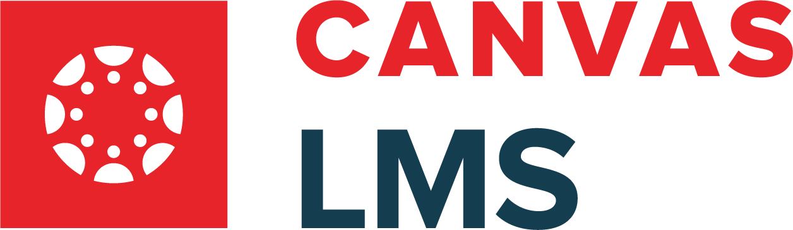

# Equigrade: Targeted Grading Adjustments


Equigrade introduces a targeted approach to grading, designed to handle outliers such as missing assignments or instances of low performance that might not accurately reflect a student's current understanding. Its aim is to streamline specific aspects of the grading process, particularly focusing on improving fairness by addressing outliers.

# What is Equigrade?

Equigrade provides tools to assist educators in adjusting grades for specific scenarios, offering a straightforward solution for managing performance outliers. Equigrade focuses on specific grading adjustments, enabling instructors to substitute or adjust grades under certain conditions, thereby addressing discrepancies in student performance.

# Key Features of Equigrade:

- **Grade Adjustment for Fair Evaluation**: Equigrade enables educators to replace a lower grade with a more recent, higher one on a similar assignment, recognizing and encouraging improvement over time.

- **Targeted Adjustments for Fairer Outcomes**: Equigrade allows for specific grading adjustments, offering a solution to manage cases where a single assignment may not reflect a student's overall progress or capabilities.

- **Customizable Settings for Educators**: Equigrade offers the flexibility to adjust which assignments can be substituted, set thresholds for substitutions, and manage how exceptions are handled, tailoring the system to various instructional needs.

- **Easy Integration with Canvas**: For convenience, Equigrade is designed to integrate with the Canvas Learning Management System (LMS), ensuring seamless operation between systems.

## Addressing the Issue of Inconsistent Engagement

Equigrade provides an alternative to the traditional method of dropping the lowest scores, encouraging consistent effort and engagement by recognizing and rewarding improvement and mastery over time.


#### Traditional Approaches to Assignments

- **Strategic Laziness**: Traditional grading systems that permit dropping the lowest scores or skipping assignments may inadvertently encourage students to selectively engage with their coursework. Knowing they can afford to skip assignments without impacting their final grade might lead some students to bypass tasks they perceive as challenging or less interesting.

- **Poor Time Management**: The option to drop assignments can serve as a safety net for poor time management, allowing students to procrastinate and then rely on the ability to exclude their poorest performances from their final grade calculation.

- **Inconsistent Engagement**: Dropping assignments can result in an uneven engagement with the course material. Students might opt to concentrate their efforts on assignments they believe will be easier for them to excel in, potentially neglecting areas of the curriculum that could offer valuable learning experiences.

#### How Equigrade Addresses These Issues

Equigrade eliminates the need for assignment dropping or skipping by:

- **Encouraging Continuous Improvement**: By allowing grades from later assignments to substitute lower grades from earlier, related assignments, Equigrade motivates students to persistently engage with all course material and strive for improvement throughout the course.

- **Fostering Consistent Engagement**: Since all assignments have the potential to contribute to the final grade, students are encouraged to consistently participate and invest effort across all tasks. This consistent engagement ensures a comprehensive understanding of the course material.

- **Rewarding Growth and Mastery**: Equigrade's focus on improvement and mastery over time shifts the emphasis from tactical avoidance of difficult assignments to continuous learning and skill development.

By addressing the pitfalls of traditional dropping or skipping policies, Equigrade promotes a more holistic and effective learning environment that encourages students to engage with the entire curriculum, manage their time wisely, and continuously strive for improvement.


# Equigrade Example Use Scenario:  Python Course

## Course Setup

In this scenario, we explore the application of Equigrade in an advanced Python programming course. This example highlights the system's ability to reflect significant improvements in student performance through its grade substitution feature.

- **Assignments**: The curriculum includes 10 challenging programming assignments that cover advanced Python topics, such as algorithms, data structures, web development, and data science.
- **Grading Policy**: The instructor enables up to 2 grade substitutions for assignments if students show marked improvement on similar or related topics later in the course.


# Example Use Scenario: Understanding Equigrade Through Student Performance

This scenario demonstrates Equigrade's impact on student grades across a series of related assignments. Below is a table showing grades for three students - Yoshi, Birdo, and Toad - on four assignments. Following the table, we explore the topical overlaps between these assignments.

| Student   | Assignment 1 | Assignment 2 | Assignment 3 | Assignment 4 |
|-----------|--------------|--------------|--------------|--------------|
| Yoshi     | 75%          | 85%          | 95%          | 80%          |
| Birdo     | 60%          | 92%          | 87%          | 90%          |
| Pathfinder| 50%          | 78%          | 88%          | 94%          |

## Assignment Topics and Overlap

The assignments cover related areas of the course material, ensuring that students have multiple opportunities to demonstrate their understanding and improvement over time:

- **Assignment 1**: Basics of Programming
- **Assignment 2**: Data Structures
- **Assignment 3**: Algorithms using Data Structures
- **Assignment 4**: Project utilizing both Programming Basics and Data Structures

Here's a Venn Diagram representing the overlap between these topics:


This visual representation highlights how assignments are designed to interconnect, allowing Equigrade to effectively identify opportunities for grade substitution based on topic relevance and student improvement.

## Visualizing Student Improvement with Equigrade

Equigrade's grading flexibility allows for adjustments that can more accurately reflect each student's learning trajectory. For instance:

- Yoshi shows consistent improvement, especially in topics related to Data Structures and Algorithms, which is reflected in their grades for Assignments 2 and 3.
- Birdo starts with a lower grade in the Basics of Programming but quickly demonstrates a strong grasp of Data Structures and their application, leading to high grades in subsequent assignments.
- Toad initially struggles but shows remarkable improvement by the final project, illustrating their overall mastery of the course material.

Through Equigrade, instructors have the flexibility to adjust grades for earlier assignments, ensuring that final grades more accurately represent student learning and progress.

## Character Images

- Yoshi: 
- Pathfinder: 
- Birdo: 

Replace `link-to-yoshi-image.png`, `link-to-birdo-image.png`, and `link-to-toad-image.png` with the actual links to your images.


# Built With

- Python for core functionality
    
- Integration with Canvas LMS
    


Please check [SETUP.MD](SETUP.md) for setup instructions and follow it very carefully.


# Motivation & roadmap

Well, I guess this will probably be the most casual section of this readme, but it's for a reason. The main motivation behind this project began in the Fall of 2022 at UC Davis. I was a student assistant for Matthew Butner (co-creator) of this project. We were working on an entry-level class called [ECS 32A](https://cs.ucdavis.edu/schedules-classes/ecs-032a-introduction-programming), which is a very basic Python course for beginners.

Unfortunately, we discovered a trend that a significant portion of the class either failed or performed very poorly. So, in December 2022, Professor Butner took the initiative and organized a team to help brainstorm ideas for creating a grade-enhancement algorithm for classes that are mostly project-based, like his. I was fortunate enough to be part of that team, and we worked on and off, with hour-long brainstorming sessions for around 6 months. However, in the end, I remained on the team, and in the summer, Professor Butner and I both agreed on a concept like Equigrade. However, we had one problem: we didn't have enough people for this project. It was just me and him.

I was concurrently interning at LLNL and still am, actually. I realized that one thing I really wanted to do was project management, and I pitched the idea to him, and he gave me the green light. This was in August 2023. I decided to ask around as many people as I could, friends, classmates, etc. The response was quite nice. In the end, at the height of the project, I had around 20 people on this team. We had team members with incredibly impressive backgrounds, from interning at big tech companies and being much better at coding than me, to people who were just getting started with a CS degree. And yes, that was the point of all this. I wanted to give people something legitimate to work on for their resume, to learn, and to have others work on something fun too on the side.

I created a couple of different teams for this project. For this phase, the two primary ones that had to execute were the Development Team and the QA Team. The names and responsibilities are self-explanatory; the developers created, and QA did debugging, etc.

The development timeframe of this project took around 3 months, from August 2023 to December 2023.

The roadmap that I would love for this project is for it to be used by UC Davis faculty, especially the CS department and then other departments, while concurrently reaching other schools that use Canvas. I wholeheartedly believe that this project has the potential to make learning, to some degree, much more equitable and grades more holistic - hence the name, Equigrade.

This was the first project I ever managed, and I hope it is just the beginning of many others to follow that are much larger in scale and with larger real-world ramifications.

Thank you. :)


# Contributing

Currently this repo is private and approved users through me or Matthew Butner will be able to contribute

We welcome contributions from the community! If you have suggestions for enhancements or have identified bugs, here's how you can contribute:

1. **Fork the Repository:** Start by forking the Equigrade repository to your GitHub account.
2. **Create a Feature Branch:** Make your changes in a new branch dedicated to the feature or fix you're working on.
3. **Commit Your Changes:** Write clear, concise commit messages that describe the enhancements or fixes.
4. **Open a Pull Request:** Submit a pull request from your feature branch to Equigrade's main branch for review.
5. **Email Proposal:** For significant changes or new features, please email sekendernaveed1@gmail.com with your proposal before starting work. This allows us to discuss the enhancement and how it fits into the 


# Support
For support either email me at sekendernaveed1@gmail.com or if you have GPT + subscription use this customer [GPT](https://chat.openai.com/g/g-cAuHru6MG-equigrade) to help you.


# Contact

    Project Maintainer/Manager: Naveed Sekender - sekendernaveed1@gmail.com
    UC Davis Faculty: Matthew Butner - mfbutner@ucdavis.edu 
    Project Link: (https://github.com/SekenderNaveed1/Equigrade)

# Acknowledgments

    Special thanks to:
    Matthew Butner - UC Davis Faculty Member
    Gavin Lang  - Lead of QA team
    Amabel Gale - Lead of DEV team


# License
License ```LGPL-2.1 license```
Distributed under the MIT License. See [LICENSE](LICENSE) for more information.


# Important Notice: Ethical Use Policy

## Strict Prohibition of Unethical Use

We, the creators of Equigrade, have developed this software with the intention of enhancing the educational experience, providing flexibility in grading, and supporting educators in accurately assessing student performance. It is built on principles of integrity, transparency, and fairness.

**We strictly prohibit any form of unethical use of Equigrade, including but not limited to:**

- **Hacking into educational systems:** Unauthorized access to, or manipulation of, educational records, grades, or systems.
- **Grade manipulation:** Using Equigrade to unfairly alter or manipulate student grades or academic records.
- **Unauthorized use:** Deploying or using Equigrade in any manner that violates educational institution policies, local laws, or regulations.

### Responsibility and Compliance

Users of Equigrade are expected to uphold the highest standards of ethical conduct and ensure compliance with all relevant institutional policies and legal regulations. It is your responsibility to use Equigrade in a manner that respects the rights and privacy of all individuals involved in the educational process.

## Reporting Unethical Use

If you are aware of any misuse of Equigrade or have concerns regarding potential ethical violations, please report them immediately to the academic affairs department
---

Your cooperation is essential in maintaining the integrity and trustworthiness of Equigrade. Together, we can ensure that Equigrade remains a tool for positive educational advancement, reflecting our shared values of honesty, fairness, and academic integrity.

